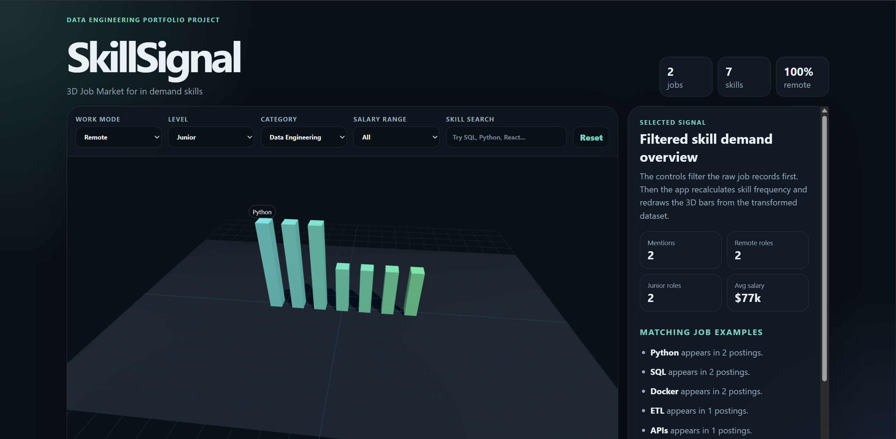

# SkillSignal — 3D Job Market Visualizer

SkillSignal is an interactive Three.js dashboard that visualizes skill demand from structured job-market-style data.

The project loads a local JSON dataset of sample tech job postings, filters the records by work mode, experience level, category, salary range, and searched skill, then transforms the matching jobs into skill-frequency signals. Each skill is displayed as a 3D bar, where taller bars represent skills that appear more often in the filtered dataset.

## Live Demo

[View SkillSignal live](https://joeypeck1987.github.io/skillsignal-threejs/)

## Preview

## Features

* Interactive 3D skill-demand chart built with Three.js
* Local JSON job dataset
* Filters for work mode, experience level, category, salary range, and skill search
* Hover labels for identifying skill bars
* Clickable bars that update a details panel
* Summary metrics for matching jobs, skill signals, and remote role percentage
* Data pipeline explanation included in the interface

## Data Flow

1. Load local `jobsData.json`
2. Filter raw job records by selected dashboard controls
3. Transform matching job records into skill-frequency signals
4. Render the transformed skill data as 3D bars
5. Display selected skill details in the side panel

## Tech Stack

* HTML
* CSS
* JavaScript
* Three.js
* JSON
* GitHub Pages

## What I Learned

This project helped me practice building a small data pipeline in JavaScript: loading structured data, filtering records, transforming the filtered results, and rendering the output visually. It also helped me connect frontend development skills with data engineering concepts such as structured records, transformation steps, and dashboard-style presentation.

## Future Improvements

* Connect the project to a real job data API
* Add more detailed salary and location analysis
* Add charts for remote vs onsite roles
* Add saved filter presets
* Expand the dataset with more job categories
